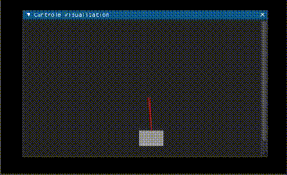

# CartPole Reinforcement Learning with Visualization

## Project Overview

This project implements a reinforcement learning model to solve the classic CartPole problem from OpenAI Gym. The CartPole environment consists of a pole attached by an un-actuated joint to a cart, which moves along a frictionless track. The goal is to balance the pole on the cart by moving the cart left or right.

The reinforcement learning model, built using PyTorch and PyTorch Lightning, learns to keep the pole balanced by predicting actions based on the current state of the environment. The state is represented by a 4-dimensional vector, including the position and velocity of the cart, and the angle and rotation rate of the pole.

To enhance understanding and engagement, the project includes a real-time visualization of the CartPole environment using Dear PyGui, a modern Python GUI framework. This visualization shows the cart and pole in action, updating with each step based on the model's decisions.

## Key Features

- **Reinforcement Learning Model**: Implemented using PyTorch and PyTorch Lightning for efficient and scalable training.
- **Real-Time Visualization**: Dear PyGui is utilized to render the state of the CartPole environment, providing an intuitive visual feedback of the model's performance.
- **OpenAI Gym Environment**: The CartPole environment from OpenAI Gym offers a standard, widely-used platform for reinforcement learning tasks.

*The above screen recording demonstrates the CartPole environment in action*

## Setup and Usage

1. **Installation**:
   - Ensure Python is installed on your system.
   - Install required packages: `gym`, `torch`, `pytorch_lightning`, `numpy`, and `dearpygui`.

2. **Running the Project**:
   - Clone the repository: https://github.com/arashk7/QLearning-CartPole.git
   - Navigate to the project directory: `cd QLearning-CartPole`
   - Run the script: `python test_cartpole_Qlearning.py`

3. **Training the Model**:
   - The model trains in real-time as the CartPole environment runs.
   - Monitor the performance through the Dear PyGui window.
